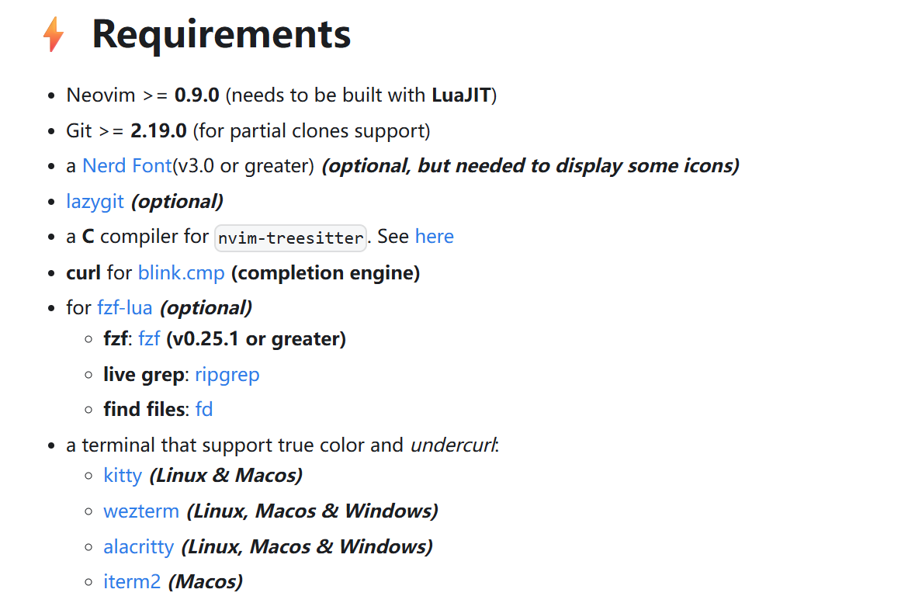

**一、安装zsh**  
MacOS((MacOS默认使用zsh作为shell解释器))
```shell
brew install zsh
```

ubuntu

```shell
sudo apt update
sudo apt install zsh
```

Arch Linux

```shell
pacman -S zsh
```

二、设置zsh作为默认的shell

```shell
sudo chsh -s /bin/zsh
```

重启查看是否生效

```shell
echo $SHELL
```

**三、安装oh my zsh**

使用国内镜像（官方github经常失败）

```shell
wget https://gitee.com/mirrors/oh-my-zsh/raw/master/tools/install.sh && chmod 777 install.sh && ./install.sh
```
执行完后默认样式：


**四、安装powerlever10k主题**

```shell
git clone https://github.com/romkatv/powerlevel10k.git $ZSH_CUSTOM/themes/powerlevel10k
```

此时.oh my zsh文件夹下的custom有themes就是p10k，下载位置是zsh的custom的themes下

再编辑~/.zshrc把主题修改为p10k

```shell
ZSH_THEME="powerlevel10k/powerlevel10k”
```

重启终端：exit后输入zsh会进入p10k的设置界面，或者输入

```shell
p10k configure
```
p10k的配置默认就可以，下面换成我的配置

下载我的p10k配置文件,覆盖~/.p10k.zsh文件

```shell
https://github.com/upupGuan/dotfiles.git
```
重启终端，结果如下：


然后exit退出后重新进入zsh进入p10k配置文件，发现乱码，因为字体没有安装，进入下面链接，在自己电脑上安装pk10所需要字体，windows直接点击所下载ttf文件就可以安装字体到系统，然后在终端中选择字体即可：

```
https://github.com/romkatv/powerlevel10k?tab=readme-ov-file#meslo-nerd-font-patched-for-powerlevel10k
```

按照这里的要求，下载字体文件，并在自己的终端配置（注意哦，字体下载到本机电脑，不是服务器上）  

再终端选择MesloLGS NF 这个字体（不同终端配置字体的方式不一样）

VSCODE是 设置 搜索font 选择终端，输入MesloLGS NF 

xshell是右键会话选择属性，里面的外观选择MesloLGS NF 字体

windows的powershell设置终端字体方法如下：


最终在终端显示的样式如下：


五、安装zsh插件

最常用的两款插件：

```
# zsh-autosuggestions自动提示插件
git clone https://github.com/zsh-users/zsh-autosuggestions ${ZSH_CUSTOM:-~/.oh-my-zsh/custom}/plugins/zsh-autosuggestions
# zsh-syntax-highlighting语法高亮插件
git clone https://github.com/zsh-users/zsh-syntax-highlighting.git ${ZSH_CUSTOM:-~/.oh-my-zsh/custom}/plugins/zsh-syntax-highlighting
```

修改~/.zshrc

```shell
# 启用插件
plugins=(
  git
  zsh-autosuggestions
  zsh-syntax-highlighting
)
```
至此，打造zsh终端结束。

六、配置neofetch
下载和安装neofetch
MacOS
```
brew install neofetch
```
Ubuntu
```
sudo apt install neofetch
```
测试是否安装正确:
```
neofetch
```
运行第一次后，就会在~目录下出现.config文件夹如下图，里面配置文件neofetch文件夹,

下载我的配置文件：后，找到对应系统里面的neofetch文件夹替换即可得到我的样式。


最后在~/.zsh中 加入neofetch命令，每次启动终端都执行neofetch


七、安装lazyvim
首先安装lazyvim的要求，下载所需要的环境
```
http://www.lazyvim.org/
```

注意：Ubuntu默认sudo apt install neovim 版本非常低，需要0.9以上需要unstable方式，用如下方式：
```
# 1. 添加 unstable PPA（获取最新开发版）
sudo add-apt-repository ppa:neovim-ppa/unstable

# 2. 更新软件源并安装
sudo apt update
sudo apt install neovim

# 3. 验证版本（安装后执行）
nvim --version   保证版本>-0.9 才能实用lazyvim
```
按照lazyvim所给的要求，逐一安装：  
安装Nerd Font字体（Linux常见安装字体方法）

```
1）下载字体
wget https://github.com/ryanoasis/nerd-fonts/releases/download/v3.0.2/JetBrainsMono.zip  
2）解压(可能需要先创建share/fonts/)
unzip JetBrainsMono.zip -d ~/.local/share/fonts  # 用户级安装
或系统级安装（需 sudo）：
sudo unzip JetBrainsMono.zip -d /usr/share/fonts
3）刷新字体库
fc-cache -fv  # 强制刷新
```
lazygit安装，参考https://github.com/jesseduffield/lazygit?tab=readme-ov-file#debian-and-ubuntu


安装gcc，如果已经有了就不需要安装了
```
sudo apt install gcc
gcc --version
```

安装curl ,一般都有，不用安装

安装fzf,ripgrep,fd
```
sudo apt install fzf
sudo apt-get install ripgrep
sudo apt install fd-find
```
安装lazyvim
http://www.lazyvim.org/installation


# 感谢
[1]https://github.com/Shaobin-Jiang/dotfiles
[2]https://github.com/charleschetty/dotfile